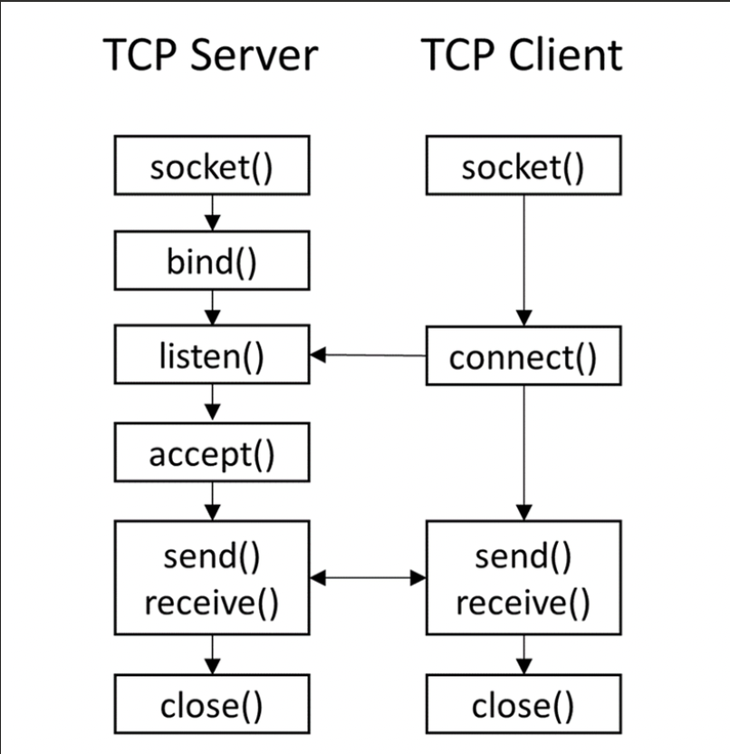

## Socket-eknek két fő típusa van
### Steam Socket (SOCK_STREAM)
- **TCP** protokolt használ
- **Sorrendhelyesség** biztosítása
- **Duplikátumok elkerülése**
- **Adatokat biztosan megérkeznek**
- **Használat:** Letöltések, web böngészés
### Datagram Socket (SOCK_DGRAM)
- **UDP** protokolt hasnáalt
- **Sorrendhelyesség nincs biztosítva**
- **Duplikátumok előfordulhatnak**
- **Adatok nem biztos, hogy megérkeznek**
- **Használat:** Videó, hang küldése

## TCP Socket
Kommunikáció biztosításához a **kliens** és a **szerver** oldalon is létre kell hozni **egy-egy** socketet, **ugyan azokkal a paraméterekkel**  
```python 
import socket 
sock = socket.socket(socket.AF_INET, socket.SOCK_STREAM) 
```
- Első paraméter a socket family
    - AF_INET -> IPv4
    - AF_INET6 -> IPv6
- Második paraméter a socket típusa


A képen látható, hogy TCP protokoll esetén, hogyan működik a kommunikúció.  
### Szerver oldal  
Miután létre lett hozva a socket a szerver és a client oldalon is, a **server oldalán bind-elni kell a socket-ünket egy porthoz**, hogy az operációs rendszer tudja, hogy a mi alkalmazásunknak szólnak a csomagok. 
Bind mindig **tuple-t vár**, első paraméter a **hostname vagy az IP cím**, második pedig a **port**. 
```Python
addr = ("127.0.0.1", 8000)
sock.bind(addr)
```
Ezután server oldalon elkezdjük figyelni a csatlakozni kívánó klienseket.  
**Listen() függvény** használatával valósul ez meg. Egy **szám paramétert vár**, ami megmondja, hogy hány kapcsolat várakozhat, amikor a szerver elfoglalt, mielőtt visszautasítja azokat. 
```Python
sock.listen(0)
print(f"Server is listening on {addr[0]}:{addr[0]}")
```
Amikor elfogadjuk **accept() függvénnyel** a kapcsolatot, **létrejön egy új socket**, amellyel tudunk **küldeni és fogadni adatokat a klienstől**.   
Ez egy másik socket, mint amit eddig létrehoztunk. A korábban létrehozott socket arra kell, hogy az új kapcsolatokat fogadni tudjuk.
```Python
connection_sock, client_address = sock.accept()
with connection_sock:
    print(f"Connection from {client_address}")
```
Most pedig jöhet a küldés és a fogadás. Itt **mi döntjük el**, hogy a szerver és a kliens **milyen sorrendben küld és fogad adatot**. Lehet, hogy a szerver csak fogad, de lehet, hogy felváltva küldenek stb. 
```Python
data = connection_sock.recv(16).decode()
print(f"Data: {data}")
```
Végezetül pedig le kell zárnunk a socketet, feltéve hogy nem with-et használtunk. Fontos megjegyezni, hogy Stream Socket esetében, amikor valaki bezárja a socketet egy utolsó üzenet elküldésre kerül, aminek nincs tartalma. Gyakorlatilag egy üres string. Ez egy jelzés a másik félnek, hogy részünkről véget ért a kommunikáció.
```Python
sock.close()
```
### Kliens oldal
Itt egyszerűen csak csatlakoznunk kell a szerverre az IP címe és a port száma alapján.
```Python
addr = ("127.0.0.1", 8000)
sock.connect(addr)
```
Ezek után pedig küldhetünk is adatokat a szervernek vagy akár fogadhatunk is. Küldés során használhatjuk a **struct-ot** vagy ha csak simán **string-et küldünk elég az encode()** is.
```Python
sock.send("Hello".encode())
print("Message sent.")
```


